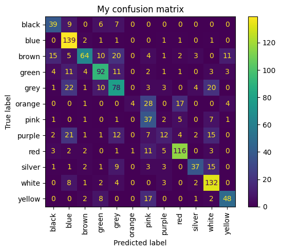
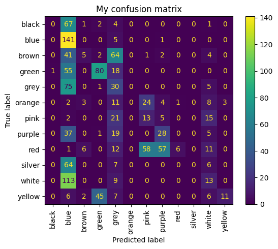

# ai_labs
Все лабораторные представленные в виде блокнотов с соответствующими названиями.
Датасет хранится в папке data.

Датасет: 6000+ Store Items Images Classified By Color. Состоит из набора разных вещей и одежды. 12 классов.

Ссылка на датасет: https://www.kaggle.com/datasets/imoore/6000-store-items-images-classified-by-color

## Lab2. Полносвязная свёрточная сеть

Была реализована полносвязная модель из 5 слоёв Linear, в качестве функции активации выбран relu.

Получены результаты: loss = 1.1114482879638672, samples = 384, accuracy 0.6314102564102564

## Lab3. Свёрточная сеть с метриками

Была реализована модель из 6 слоёв Conv2d и 2 Linear, также 3 слоя с MaxPool2d, в качестве функции активации выбран relu.
Получены результаты: loss = 1.0774588584899902, samples = 384, accuracy 0.6394230769230769

Также были добавлены метрики:

Accuracy: 63.94%

Precision: 64.27%

Recall: 58.48%

И матрица ошибок:

## Lab4. Улучшение показателей метрик свёрточной сети

Тесты с разными аугментациями:

1 тест. Только аугментации

    A.Flip(p=0.3),
    A.ElasticTransform(alpha=1.15, sigma=50, alpha_affine=10),
    A.RandomBrightnessContrast(p=0.4),
    A.Blur(blur_limit=3),
    A.Normalize(
        mean=[0.485, 0.456, 0.406], 
        std=[0.229, 0.224, 0.225], 
    ),
    ToTensorV2()

  Результаты ухудшились.
  loss = 0.8410181403160095, samples = 384 accuracy 0.2620192307692308

  Accuracy: 26.20%
    
  Precision: 29.38%
  
   Recall: 21.78%

  

## Lab5. Свёрточная сеть на ResNet
